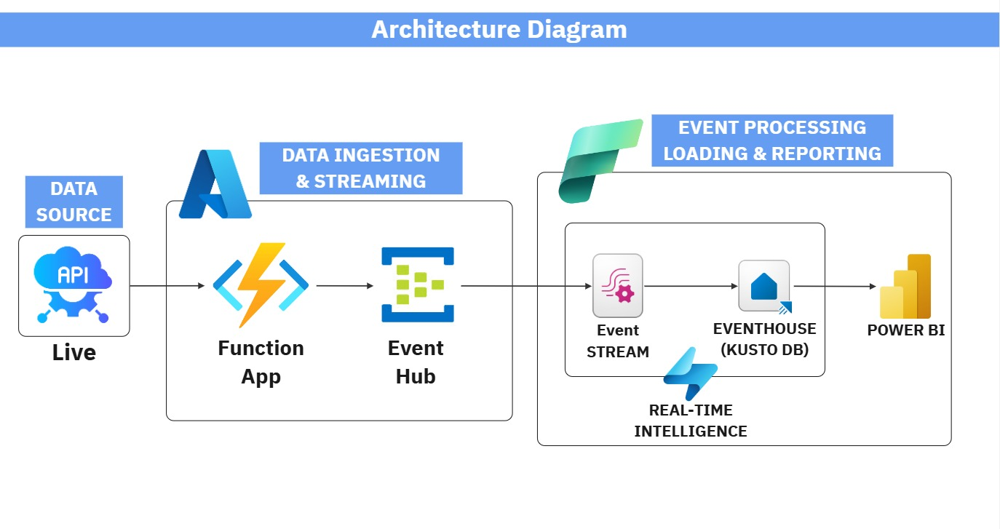
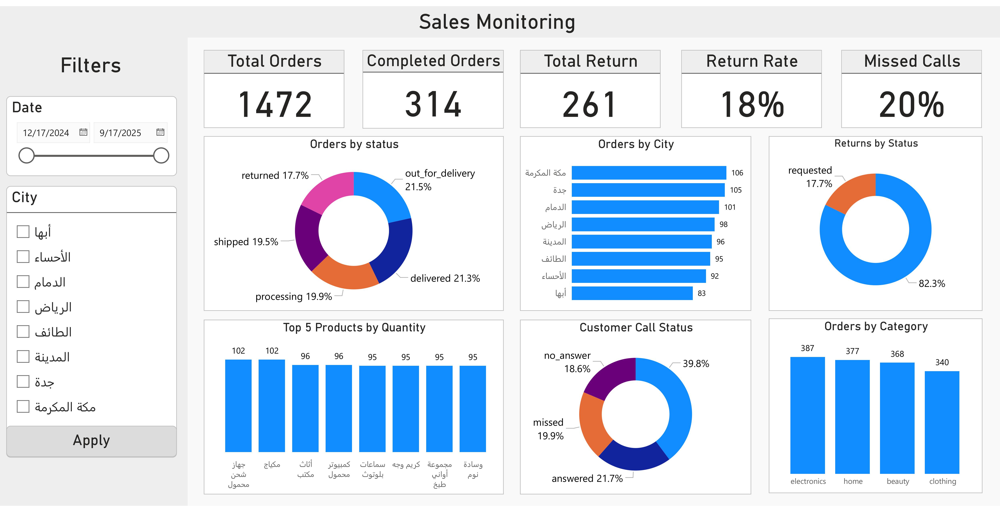
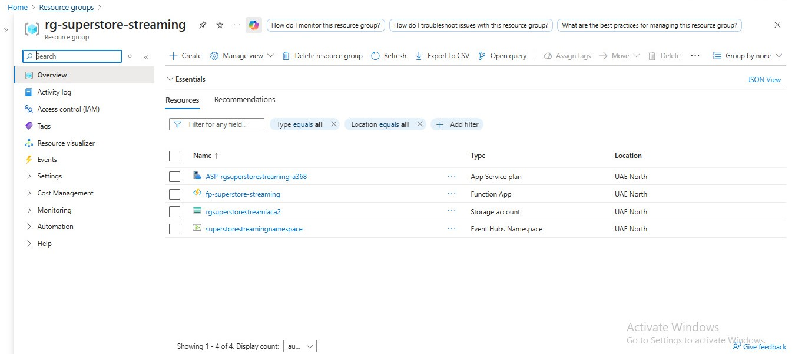
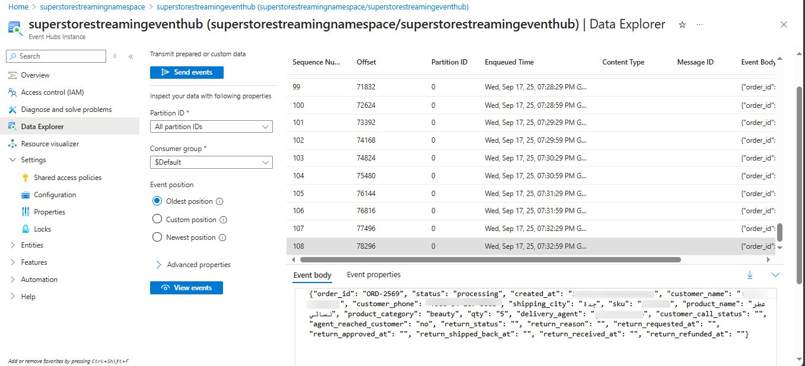
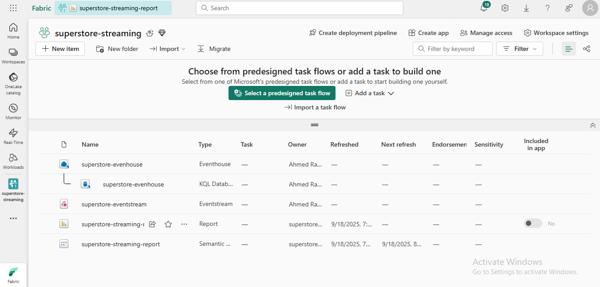
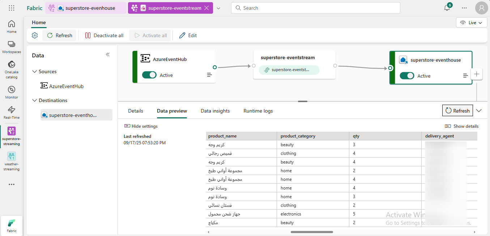
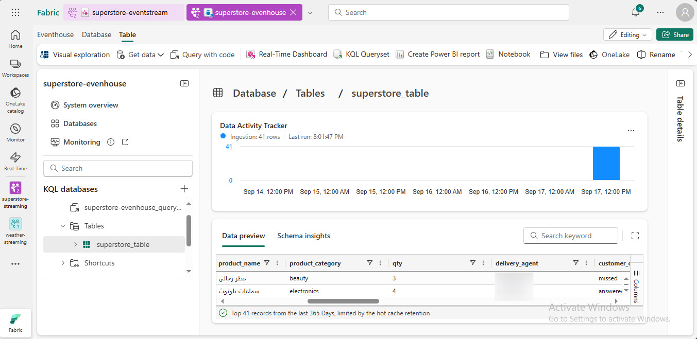

# Real-Time E-commerce Data Pipeline with Azure & Microsoft Fabric

)

---

## 📌 Overview
This project delivers a **real-time data pipeline** fully built within **Microsoft Fabric** and **Azure**.  
It ingests data from an e-commerce source, streams it into Fabric, and provides **live dashboards** in Power BI for monitoring orders, returns, and customer interactions.

---

## 🚀 Architecture
- **Azure Function App** → Ingests records from API and streams them to **Azure Event Hub** every 30 seconds.  
- **Azure Event Hub** → Acts as the scalable event broker for real-time data.  
- **Microsoft Fabric Event Stream** → Subscribes to Event Hub, applies lightweight transformations, and routes data to Eventhouse.  
- **Microsoft Fabric Eventhouse** → Stores structured streaming data optimized for analytics.  
- **Power BI (Fabric Integration)** → Provides real-time dashboards and KPIs from Eventhouse.  

### 🖼 Architecture Diagram

---

## 📊 Key Features
- Real-time order and return monitoring.  
- KPI cards: **Total Orders, Completed Orders, Total Return, Return Rate %, Missed Calls %**.  
- Visual insights:  
  - Orders by Status (Donut Chart)  
  - Returns by Reason (Bar Chart)  
  - Returns by Status (Donut Chart)  
  - Customer Call Status (Pie Chart)  
  - Top 5 Products by Quantity (Bar Chart)  
  - Orders by Category (Column Chart)  
  - Orders by City (Bar Chart)  

---

## 📈 Dashboard Preview
The final dashboard in **Power BI (Fabric)** includes KPIs and multiple categorical breakdowns:

---

## 💡 Business Impact
- Provided **real-time visibility** into e-commerce operations.  
- Reduced latency from ingestion to visualization to **under one minute**.  
- Enabled tracking of **returns, missed calls, and top-performing products** instantly.  
- Supported **faster decision-making** and improved customer service by detecting issues early.  

---

## 📷 Project Snapshots

### 🔹 Azure Resource Group
Overview of the deployed Azure resources for the project.  

### 🔹 Azure Event Hub
Event Hub namespace and hub configured to handle streaming ingestion.  

### 🔹 Microsoft Fabric Workspace
Fabric workspace showing the created Event Stream, Eventhouse, and Power BI items.  

### 🔹 Microsoft Fabric Event Stream
Stream configuration subscribing to Event Hub and routing data into Eventhouse.  

### 🔹 Microsoft Fabric Eventhouse
The Eventhouse database storing structured streaming data for analytics.  

---

## 🧰 Tech Stack
- **Azure Function App** – Serverless data ingestion  
- **Azure Event Hub** – Real-time event streaming  
- **Microsoft Fabric Event Stream** – Low-code stream processing  
- **Microsoft Fabric Eventhouse** – Streaming data warehouse  
- **Power BI (Fabric)** – Real-time analytics & dashboards  

---

## 📜 License
This repository is provided for **portfolio and demonstration purposes only**.  
All sensitive data and configurations have been removed.  

---

👨‍💻 Created by [Ahmed Rabie](https://www.linkedin.com/in/ahmed-m-rabie-0ba5b120b/)
